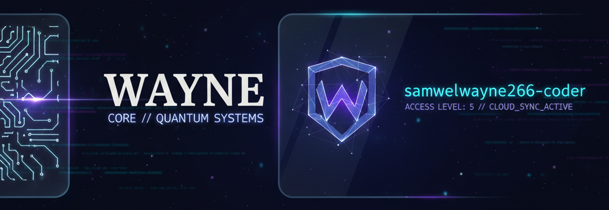

# 
SYSTEM INITIALIZED: WAYNE CORE

  

  
  
  

---

### 🟢 Developer Diagnostics
| Attribute | Data |
| :--- | :--- |
| **System Identity** | samwelwayne266-coder |
| **Main Core** | [Wayne Core Dashboard](https://samwelwayne266-coder.github.io/samwelwayne266.github.io/) |
| **Current Focus** | Full-Stack Architecture & Mobile Systems |
| **Secret Key** | `WAYNE` |

---

### 🛠 Tech Stack Pulse

  
  
  
  
  
  
  
  
  
  
  
  
  
  
  

---

### 📊 System Activity
## 🐍 Contribution Snake
<picture>
  <source media="(prefers-color-scheme: dark)" srcset="https://raw.githubusercontent.com/samwelwayne266-coder/samwelwayne266-coder/output/github-contribution-grid-snake-dark.svg">
  <source media="(prefers-color-scheme: light)" srcset="https://raw.githubusercontent.com/samwelwayne266-coder/samwelwayne266-coder/output/github-contribution-grid-snake.svg">
  
</picture>

---

### 📡 Connection Terminals
- 💼 **Portfolio:** [Visit Wayne Core](https://samwelwayne266-coder.github.io/samwelwayne266.github.io/)
- 📧 **Transmission:** `samwelplays@gmail.com`
- 🏗 **Latest Projects:** Scroll down to see the active repository stream.

---

**👁️ Visitor Count**

---

    
    
    

---

  **Copyright © [WAYNE CORE](https://github.com/samwelwayne266-coder)**

